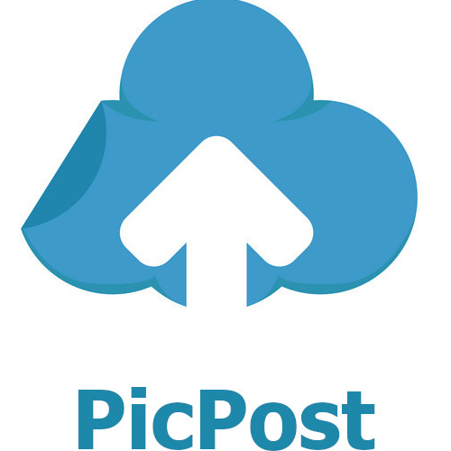

<a name="readme-top"></a>

<!-- PROJECT LOGO -->
<br />
<div align="center">
  <a href="https://github.com/othneildrew/Best-README-Template">
    
  </a>

  <h3 align="center">PicPost</h3>

  <p align="center">
Welcome to PicPost, the premier image upload platform that allows you to easily store and share your photos with the world. With our user-friendly interface and high-quality image hosting, you can upload your images with ease and generate a unique link to share with friends, family, and colleagues. Whether you're a professional photographer or just someone who loves to capture life's special moments, PicPost has everything you need to keep your images safe and accessible anytime, anywhere. Start uploading and sharing your images today and join the PicPost community of fellow photo enthusiasts
    <br />
</div>


<!-- TABLE OF CONTENTS -->
<!-- <details>
  <summary>Table of Contents</summary>
  <ol>
    <li>
      <a href="#about-the-project">About The Project</a>
      <ul>
        <li><a href="#built-with">Built With</a></li>
      </ul>
    </li>
    <li>
      <a href="#getting-started">Getting Started</a>
      <ul>
        <li><a href="#prerequisites">Prerequisites</a></li>
        <li><a href="#installation">Installation</a></li>
      </ul>
    </li>
    <li><a href="#usage">Usage</a></li>
    <li><a href="#roadmap">Roadmap</a></li>
    <li><a href="#contributing">Contributing</a></li>
    <li><a href="#license">License</a></li>
    <li><a href="#contact">Contact</a></li>
    <li><a href="#acknowledgments">Acknowledgments</a></li>
  </ol>
</details> -->


<!-- ABOUT THE PROJECT -->
## About The Project

[![Product Name Screen Shot][product-screenshot]](https://example.com)

Our project is an image upload website that allows users to easily and quickly upload their images and receive a link to share the image with others. Utilizing the API from upload.io, we are able to store the images and generate a unique link for each image that is uploaded. Built using ReactJS and Tailwind, our site is user-friendly and visually appealing, making it easy for users to navigate and utilize the image uploading and sharing features. Whether you're a professional photographer or just someone who loves to capture life's special moments, our site has everything you need to keep your images safe and accessible anytime, anywhere.


 <svg viewBox="0 0 128 128">
            <g fill="#61DAFB"><circle cx="64" cy="64" r="11.4"></circle><path d="M107.3 45.2c-2.2-.8-4.5-1.6-6.9-2.3.6-2.4 1.1-4.8 1.5-7.1 2.1-13.2-.2-22.5-6.6-26.1-1.9-1.1-4-1.6-6.4-1.6-7 0-15.9 5.2-24.9 13.9-9-8.7-17.9-13.9-24.9-13.9-2.4 0-4.5.5-6.4 1.6-6.4 3.7-8.7 13-6.6 26.1.4 2.3.9 4.7 1.5 7.1-2.4.7-4.7 1.4-6.9 2.3C8.2 50 1.4 56.6 1.4 64s6.9 14 19.3 18.8c2.2.8 4.5 1.6 6.9 2.3-.6 2.4-1.1 4.8-1.5 7.1-2.1 13.2.2 22.5 6.6 26.1 1.9 1.1 4 1.6 6.4 1.6 7.1 0 16-5.2 24.9-13.9 9 8.7 17.9 13.9 24.9 13.9 2.4 0 4.5-.5 6.4-1.6 6.4-3.7 8.7-13 6.6-26.1-.4-2.3-.9-4.7-1.5-7.1 2.4-.7 4.7-1.4 6.9-2.3 12.5-4.8 19.3-11.4 19.3-18.8s-6.8-14-19.3-18.8zM92.5 14.7c4.1 2.4 5.5 9.8 3.8 20.3-.3 2.1-.8 4.3-1.4 6.6-5.2-1.2-10.7-2-16.5-2.5-3.4-4.8-6.9-9.1-10.4-13 7.4-7.3 14.9-12.3 21-12.3 1.3 0 2.5.3 3.5.9zM81.3 74c-1.8 3.2-3.9 6.4-6.1 9.6-3.7.3-7.4.4-11.2.4-3.9 0-7.6-.1-11.2-.4-2.2-3.2-4.2-6.4-6-9.6-1.9-3.3-3.7-6.7-5.3-10 1.6-3.3 3.4-6.7 5.3-10 1.8-3.2 3.9-6.4 6.1-9.6 3.7-.3 7.4-.4 11.2-.4 3.9 0 7.6.1 11.2.4 2.2 3.2 4.2 6.4 6 9.6 1.9 3.3 3.7 6.7 5.3 10-1.7 3.3-3.4 6.6-5.3 10zm8.3-3.3c1.5 3.5 2.7 6.9 3.8 10.3-3.4.8-7 1.4-10.8 1.9 1.2-1.9 2.5-3.9 3.6-6 1.2-2.1 2.3-4.2 3.4-6.2zM64 97.8c-2.4-2.6-4.7-5.4-6.9-8.3 2.3.1 4.6.2 6.9.2 2.3 0 4.6-.1 6.9-.2-2.2 2.9-4.5 5.7-6.9 8.3zm-18.6-15c-3.8-.5-7.4-1.1-10.8-1.9 1.1-3.3 2.3-6.8 3.8-10.3 1.1 2 2.2 4.1 3.4 6.1 1.2 2.2 2.4 4.1 3.6 6.1zm-7-25.5c-1.5-3.5-2.7-6.9-3.8-10.3 3.4-.8 7-1.4 10.8-1.9-1.2 1.9-2.5 3.9-3.6 6-1.2 2.1-2.3 4.2-3.4 6.2zM64 30.2c2.4 2.6 4.7 5.4 6.9 8.3-2.3-.1-4.6-.2-6.9-.2-2.3 0-4.6.1-6.9.2 2.2-2.9 4.5-5.7 6.9-8.3zm22.2 21l-3.6-6c3.8.5 7.4 1.1 10.8 1.9-1.1 3.3-2.3 6.8-3.8 10.3-1.1-2.1-2.2-4.2-3.4-6.2zM31.7 35c-1.7-10.5-.3-17.9 3.8-20.3 1-.6 2.2-.9 3.5-.9 6 0 13.5 4.9 21 12.3-3.5 3.8-7 8.2-10.4 13-5.8.5-11.3 1.4-16.5 2.5-.6-2.3-1-4.5-1.4-6.6zM7 64c0-4.7 5.7-9.7 15.7-13.4 2-.8 4.2-1.5 6.4-2.1 1.6 5 3.6 10.3 6 15.6-2.4 5.3-4.5 10.5-6 15.5C15.3 75.6 7 69.6 7 64zm28.5 49.3c-4.1-2.4-5.5-9.8-3.8-20.3.3-2.1.8-4.3 1.4-6.6 5.2 1.2 10.7 2 16.5 2.5 3.4 4.8 6.9 9.1 10.4 13-7.4 7.3-14.9 12.3-21 12.3-1.3 0-2.5-.3-3.5-.9zM96.3 93c1.7 10.5.3 17.9-3.8 20.3-1 .6-2.2.9-3.5.9-6 0-13.5-4.9-21-12.3 3.5-3.8 7-8.2 10.4-13 5.8-.5 11.3-1.4 16.5-2.5.6 2.3 1 4.5 1.4 6.6zm9-15.6c-2 .8-4.2 1.5-6.4 2.1-1.6-5-3.6-10.3-6-15.6 2.4-5.3 4.5-10.5 6-15.5 13.8 4 22.1 10 22.1 15.6 0 4.7-5.8 9.7-15.7 13.4z"></path></g>
            </svg>
   
<!-- GETTING STARTED -->
## Getting Started

### Installation

_Below is an example of how you can instruct your audience on installing and setting up your app. This template doesn't rely on any external dependencies or services._

1. Get a free API Key at [Upload.io](https://upload.io/)
2. Clone the repo
   ```sh
   git clone https://github.com/WiliamMelo01/ImageUploader
   ```
3. Install NPM packages
   ```sh
   npm install
   ```
4. Enter your API KEY in `.env`
   ```js
   VITE_UPLOAD_KEY = 'ENTER YOUR API';
   ```

<!-- LICENSE -->
## License

Distributed under the MIT License. See `LICENSE.txt` for more information.


<!-- CONTACT -->
## Contact

[Wiliam Melo](https://github.com/WiliamMelo01) - wiliammelo.mota@gmail.com

Project Link: [https://wiliammelo-imageuploader.vercel.app](https://wiliammelo-imageuploader.vercel.app/)
